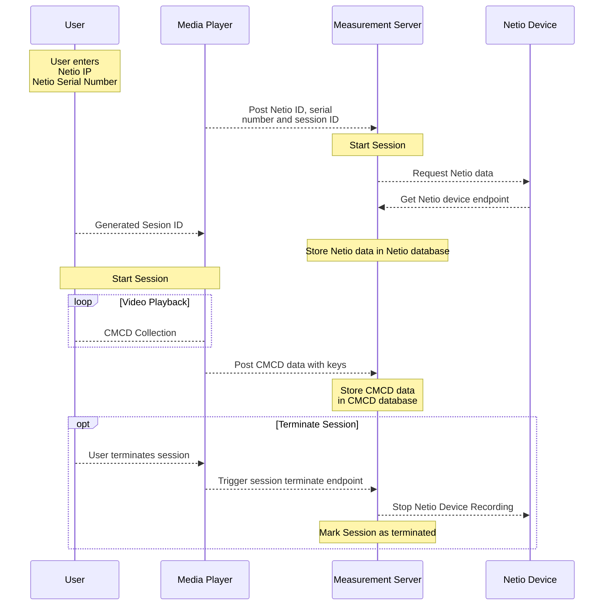

# Green Streaming and Sustainable Content Delivery: Green Streaming Analytics

## Overview

Green streaming analytics is a testing environment to collect and analyze CMCD (Common Media Client Data). The aim of the project is to provide insights into streaming efficiency, resource utilization, and the environmental impact of video streaming.

The testing environment consists of a measurement server to collect CMCD and power consumption data, a measurement database to store the data and Grafana dashboards to analyze the data. The power consumption data can be collected with a NETIO-compatible device. 
 

## Table of Contents

- [Features](#features)
- [Architecture](#architecture)
- [Getting Started](#getting-started)
- [Dockerization](#dockerization)
- [Grafana Dashboard](#grafana-dashboard)
- [License](#license)
- [Acknowledgements](#acknowledgements)


## Features

- Real-time streaming analytics
- Integration of CMCD and NETIO device data
- Grafana dashboard for visualization

## Architecture

The architecture of Green streaming analytics consists of the following components:

- **Data Ingestion:** CMCD and NetIO device data are ingested into the system.
- **Streaming Analytics:** Real-time analytics are performed on the combined dataset.
- **Data Storage:** Processed data is stored for historical analysis.
- **Grafana Dashboard:** A user-friendly interface for visualizing analytics results.



## Getting Started

To get started with Green streaming analytics, follow these steps:

1. Install Core Dependencies
    * [install docker](https://docs.docker.com/)

2. Checkout project repository (default branch: main)
    * ```git clone https://github.com/florian-baumann/awt_ws2324.git```

### Dockerization
To run Green streaming analytics using Docker and Docker Compose, follow these steps:

3. Create a new .env file by copying the provided template in the src directory:
	* ```cd src```
    * ```cp .env.template .env```
4. Build and start the services defined in *docker-compose.yml*:
	* ```docker compose up```
5. Access the application at http://localhost:5173.

### Usage

### Grafana Dashboard
Access the Grafana dashboard to visualize streaming analytics. The dashboard provides insights into:

* Content delivery efficiency
* Network and hardware resource utilization
* Environmental impact metrics

Open your web browser and go to http://localhost:3000. On the signin page, enter **admin** for username and password. Click Sign in. If successful, you will see a prompt to change the password. Click Skip.

### License

Distributed under the MIT License. See `LICENSE` for more information.

## Acknowledgements

- Fraunhofer FOKUS
- Technische Universität Berlin